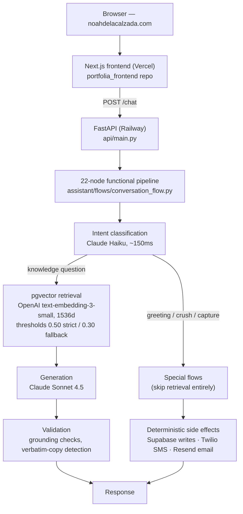

# Portfolia — Noah's AI Portfolio Assistant

[](https://github.com/iNoahCodeGuy/Noahs_Assistant/actions/workflows/tests.yml)
[](LICENSE)

**Live demo: [noahdelacalzada.com](https://noahdelacalzada.com/)**

Portfolia is a conversational portfolio: instead of reading a static site, visitors chat
with an assistant that answers from a curated knowledge base about Noah's projects and
background. It classifies intent before retrieving, runs multi-step capture flows as
deterministic state machines, and executes real side effects — database writes, SMS,
email — in production, unsupervised.

This repo is the backend. The deployed chat UI lives in
[portfolia_frontend](https://github.com/iNoahCodeGuy/portfolia_frontend).

## Architecture



Design decisions worth knowing:

- **Classify before you retrieve.** Every message is intent-classified by Claude Haiku
  before anything else runs. Greetings, small talk, and capture flows never touch the
  vector database — no embedding cost, no strange RAG fallbacks for "hello".
- **State machines, not LLM judgment, trigger side effects.** Multi-step flows (contact
  capture, crush confession) are finite state machines recovered from the conversation
  transcript on every turn — no server-side sessions. The pipeline decides when to write
  to Supabase or send an SMS; the model never "chooses" to call a tool.
- **Two retrieval thresholds.** Cosine similarity 0.50 for confident answers, 0.30 as a
  broader fallback, with grounding checks between retrieval and generation.
- **Everything is traced.** LangSmith records every LLM call with prompt, response,
  latency, and cost (optional — degrades gracefully without an API key).

## Stack

| Layer | Technology |
| --- | --- |
| Generation | Anthropic Claude Sonnet 4.5 |
| Intent classification | Anthropic Claude Haiku |
| Embeddings | OpenAI text-embedding-3-small (1536 dimensions) |
| Vector store | Supabase Postgres + pgvector (`match_kb_chunks` RPC) |
| Backend | FastAPI (Python 3.12) on Railway |
| Frontend | Next.js 14 on Vercel ([separate repo](https://github.com/iNoahCodeGuy/portfolia_frontend)) |
| Side effects | Supabase, Twilio (SMS), Resend (email) |
| Observability | LangSmith |

## Quickstart

Requires Python 3.12 and API keys for OpenAI, Anthropic, and a Supabase project with
pgvector (see [supabase/migrations](supabase/migrations/) for schema).

```bash
git clone https://github.com/iNoahCodeGuy/Noahs_Assistant.git
cd Noahs_Assistant
python3 -m venv .venv && source .venv/bin/activate
pip install -r requirements.txt
cp .env.example .env   # fill in the four required keys

# Terminal chat client
python3 chat_with_portfolia.py

# Or run the API server (what production uses)
uvicorn api.main:app --reload --port 8000
```

The API is a single endpoint: `POST /chat` with
`{"message": "...", "session_id": "...", "role": "..."}` — the same contract the live
frontend uses. Full request/response reference: [api/README.md](api/README.md).

Terminal client commands: `/quit` exit · `/clear` reset conversation · `/debug` toggle
pipeline debug output.

## Knowledge base

The KB is ~200 curated chunks across CSV files in [data/](data/), authored for retrieval
quality (one concept per chunk, question-shaped sections). Editing a CSV does **not**
change production until re-embedded:

```bash
python3 scripts/migrate_data_to_supabase.py
```

## Testing

```bash
pytest tests/test_documentation_alignment.py tests/test_memory.py tests/test_roles.py
```

This hermetic subset (no API keys needed) runs in CI on every push. The remaining legacy
suite is being repaired incrementally, and a live-API eval suite
(`tests/test_portfolia_eval.py`) requires real keys. Useful manual smoke queries after
changes:

1. "What is Noah's professional background?" — conversational, not a dry list
2. "What are some projects by Noah?" — specific projects, with personality
3. "I would like to confess a crush" — routes to the crush flow, never hits RAG
4. "asdfghjkl" — graceful redirect

## Project layout

```
assistant/            core package
  flows/              22-node pipeline + node logic (stage0–stage7)
  core/               RAG engine, response generation
  retrieval/          pgvector retriever
  services/           Twilio, Resend
  config/             settings & Supabase config
  observability/      LangSmith tracing
api/                  FastAPI app (api/main.py)
data/                 knowledge-base CSVs
scripts/              KB migration & utilities
supabase/migrations/  database schema
tests/                pytest suite
docs/                 reference docs (see docs/README.md)
```

## Deployment

- **Backend:** Railway builds the [Dockerfile](Dockerfile) and runs
  `uvicorn api.main:app`. Configuration comes from Railway environment variables
  (same names as `.env.example`).
- **Frontend:** [portfolia_frontend](https://github.com/iNoahCodeGuy/portfolia_frontend)
  deploys to Vercel and points `NEXT_PUBLIC_API_URL` at the Railway backend.

## License

MIT — see [LICENSE](LICENSE).
